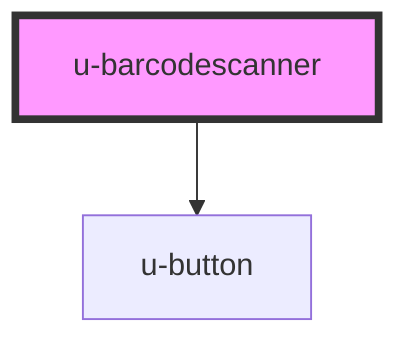

# u-barcodescanner

<!-- Auto Generated Below -->

## Properties

| Property  | Attribute | Description                                                            | Type  | Default     |
| --------- | --------- | ---------------------------------------------------------------------- | ----- | ----------- |
| `library` | `library` | [used library](https://github.com/capacitor-community/barcode-scanner) | `any` | `undefined` |

## Events

| Event        | Description                | Type                  |
| ------------ | -------------------------- | --------------------- |
| `uScan`      | return scanned element     | `CustomEvent<string>` |
| `uStartScan` | event when scan is started | `CustomEvent<void>`   |
| `uStopScan`  | event when scan is stopped | `CustomEvent<void>`   |

## Methods

### `getPermission() => Promise<void>`

force get camera permission

#### Returns

Type: `Promise<void>`

### `prepareCamera() => Promise<void>`

prepare camera for faster startup

#### Returns

Type: `Promise<void>`

### `startScanner() => Promise<void>`

begin scanning

#### Returns

Type: `Promise<void>`

### `stopScanner() => Promise<void>`

cancel scanning

#### Returns

Type: `Promise<void>`

## Dependencies

### Depends on

- [u-button](../u-button)

### Graph

----------------------------------------------

_Built with [StencilJS](https://stenciljs.com/) by Hoer_
