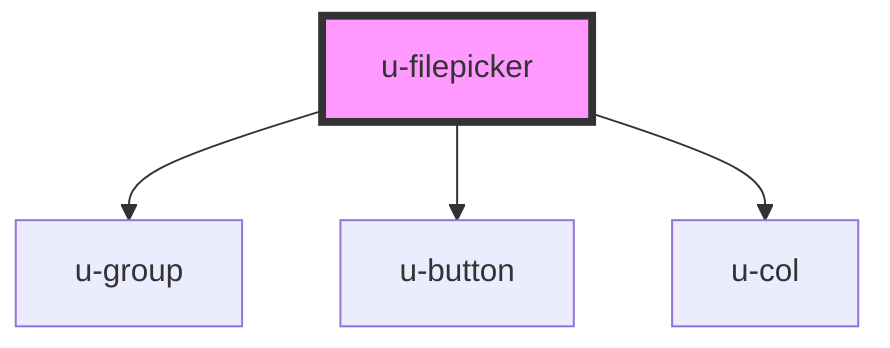

# w-filepicker

<!-- Auto Generated Below -->

## Properties

| Property     | Attribute     | Description | Type                 | Default              |
| ------------ | ------------- | ----------- | -------------------- | -------------------- |
| `fileEnding` | `file-ending` |             | `string`             | `'*'`                |
| `filePlural` | `file-plural` |             | `string`             | `'files'`            |
| `label`      | `label`       |             | `string`             | `'Choose file'`      |
| `multiple`   | `multiple`    |             | `boolean`            | `false`              |
| `noFile`     | `no-file`     |             | `string`             | `'No file selected'` |
| `size`       | `size`        |             | `"large" \| "small"` | `'small'`            |

## Events

| Event     | Description | Type                    |
| --------- | ----------- | ----------------------- |
| `uSelect` |             | `CustomEvent<FileList>` |

## Dependencies

### Depends on

- [u-group](../u-group)
- [u-button](../u-button)
- [u-col](../u-col)

### Graph

----------------------------------------------

_Built with [StencilJS](https://stenciljs.com/) by Hoer_
