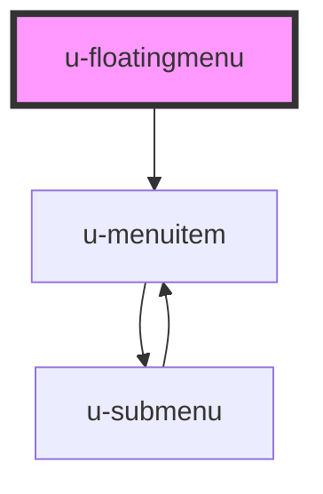

# u-floatingmenu

<!-- Auto Generated Below -->

## Properties

| Property | Attribute | Description | Type         | Default                                                                                                                                                                                                                                                                                                                                                                                                                                                                                                                                                                              |
| -------- | --------- | ----------- | ------------ | ------------------------------------------------------------------------------------------------------------------------------------------------------------------------------------------------------------------------------------------------------------------------------------------------------------------------------------------------------------------------------------------------------------------------------------------------------------------------------------------------------------------------------------------------------------------------------------ |
| `fixed`  | `fixed`   |             | `boolean`    | `false`                                                                                                                                                                                                                                                                                                                                                                                                                                                                                                                                                                              |
| `menu`   | --        |             | `MenuItem[]` | `[     { name: '+ New' },     { divider: true },     {       name: 'Edit',       subMenu: { items: [{ name: 'Redo' }, { name: 'Undo' }] }     },     { name: 'Copy' },     { divider: true },     {       name: 'Open Recent',       subMenu: {         items: [           {             name: 'HTML',             subMenu: {               items: [                 { name: 'index.html' },                 { name: 'about.html' },                 { name: 'impressum.html' }               ]             }           },           { name: 'Item 2' }         ]       }     }   ]` |

## Dependencies

### Depends on

- [u-menuitem](../u-menuitem)

### Graph

----------------------------------------------

_Built with [StencilJS](https://stenciljs.com/) by Hoer_
