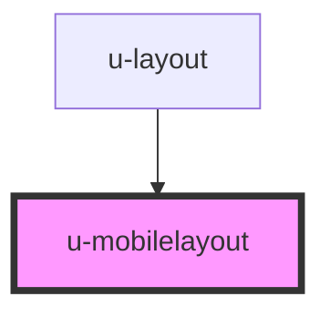

# u-mobilelayout

<!-- Auto Generated Below -->

## Properties

| Property      | Attribute      | Description | Type      | Default |
| ------------- | -------------- | ----------- | --------- | ------- |
| `showOptions` | `show-options` |             | `boolean` | `false` |
| `sideWidth`   | `side-width`   |             | `string`  | `'94%'` |

## Methods

### `activateOption() => Promise<void>`

#### Returns

Type: `Promise<void>`

### `disableOption() => Promise<void>`

#### Returns

Type: `Promise<void>`

### `showMain() => Promise<void>`

#### Returns

Type: `Promise<void>`

### `showMenu() => Promise<void>`

#### Returns

Type: `Promise<void>`

### `showOption() => Promise<void>`

#### Returns

Type: `Promise<void>`

## Dependencies

### Used by

 - [u-layout](../u-layout)

### Graph

----------------------------------------------

_Built with [StencilJS](https://stenciljs.com/) by Hoer_
