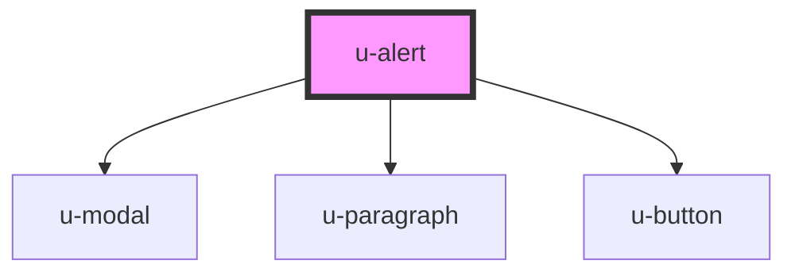

# w-alert

<!-- Auto Generated Below -->

## Properties

| Property    | Attribute    | Description | Type     | Default             |
| ----------- | ------------ | ----------- | -------- | ------------------- |
| `closeText` | `close-text` |             | `string` | `'close'`           |
| `name`      | `name`       |             | `string` | `'u-alert-default'` |

## Dependencies

### Depends on

- [u-modal](../u-modal)
- [u-paragraph](../u-paragraph)
- [u-button](../u-button)

### Graph

----------------------------------------------

*Built with [StencilJS](https://stenciljs.com/)*
