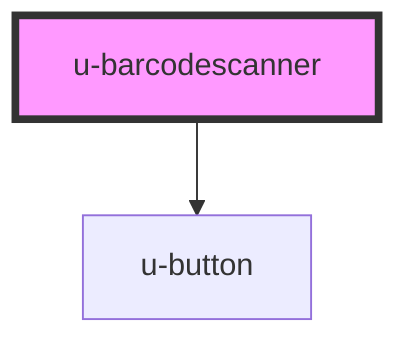

# u-barcodescanner

<!-- Auto Generated Below -->

## Properties

| Property  | Attribute | Description | Type  | Default     |
| --------- | --------- | ----------- | ----- | ----------- |
| `library` | `library` |             | `any` | `undefined` |

## Events

| Event        | Description | Type               |
| ------------ | ----------- | ------------------ |
| `uScan`      |             | `CustomEvent<any>` |
| `uStartScan` |             | `CustomEvent<any>` |
| `uStopScan`  |             | `CustomEvent<any>` |

## Methods

### `getPermission() => Promise<void>`

#### Returns

Type: `Promise<void>`

### `prepareCamera() => Promise<void>`

#### Returns

Type: `Promise<void>`

### `startScanner() => Promise<void>`

#### Returns

Type: `Promise<void>`

### `stopScanner() => Promise<void>`

#### Returns

Type: `Promise<void>`

## Dependencies

### Depends on

- [u-button](../u-button)

### Graph

----------------------------------------------

*Built with [StencilJS](https://stenciljs.com/)*
