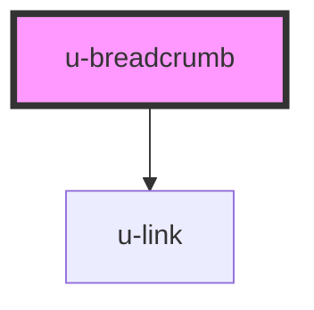

# u-breadcrumb

<!-- Auto Generated Below -->

## Usage

### Example

```html
<u-breadcrumb
  :items.prop="[
{ name: 'test1', link: '/' },	
{ name: 'test2' },	
{ name: 'test3' }	
]"
>
</u-breadcrumb>
```

## Properties

| Property    | Attribute   | Description | Type               | Default                                                                      |
| ----------- | ----------- | ----------- | ------------------ | ---------------------------------------------------------------------------- |
| `items`     | --          |             | `BreadCrumbItem[]` | `[ { name: 'test1', link: '/test' }, { name: 'test2' }, { name: 'test3' } ]` |
| `seperator` | `seperator` |             | `string`           | `undefined`                                                                  |

## Events

| Event              | Description | Type                  |
| ------------------ | ----------- | --------------------- |
| `uBreadcrumbClick` |             | `CustomEvent<string>` |

## Dependencies

### Depends on

- [u-link](../u-link)

### Graph



---

_Built with [StencilJS](https://stenciljs.com/) by Hoer_
