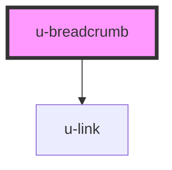

# u-breadcrumb

<!-- Auto Generated Below -->

## Properties

| Property | Attribute | Description                       | Type                       | Default     |
| -------- | --------- | --------------------------------- | -------------------------- | ----------- |
| `design` | `design`  | appereance of the breadcrumb link | `"primary" \| "secondary"` | `undefined` |
| `link`   | `link`    | link of the breadcrumb item       | `string`                   | `undefined` |

## Events

| Event              | Description                 | Type                |
| ------------------ | --------------------------- | ------------------- |
| `uBreadcrumbClick` | emit event on element click | `CustomEvent<void>` |

## Slots

| Slot        | Description        |
| ----------- | ------------------ |
| `"default"` | Breadcrumb content |

## Dependencies

### Depends on

- [u-link](../u-link)

### Graph

---

_Built with [StencilJS](https://stenciljs.com/) by Hoer_
