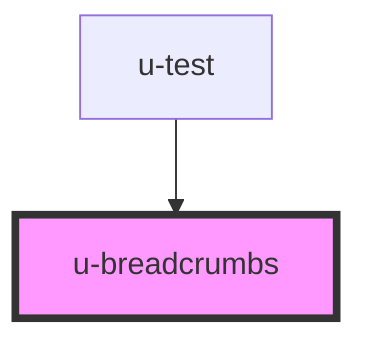

# u-breadcrumbs

<!-- Auto Generated Below -->

## Usage

### Example

```html
<u-breadcrumbs seperator=" | ">
  <u-breadcrumb>Home</u-breadcrumb>
  <u-breadcrumb link="/about" design="secondary">About</u-breadcrumb>
  <u-breadcrumb link="/contect">Contact</u-breadcrumb>
</u-breadcrumbs>
```

## Properties

| Property    | Attribute   | Description                 | Type     | Default |
| ----------- | ----------- | --------------------------- | -------- | ------- |
| `seperator` | `seperator` | element between breadcrumbs | `string` | `'›'`   |

## Events

| Event              | Description                 | Type                  |
| ------------------ | --------------------------- | --------------------- |
| `uBreadcrumbClick` | emit event on element click | `CustomEvent<string>` |

## Dependencies

### Used by

- [u-test](../u-test)

### Graph



---

_Built with [StencilJS](https://stenciljs.com/) by Hoer_
