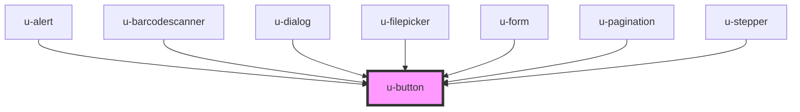

# w-button

<!-- Auto Generated Below -->

## Properties

| Property   | Attribute  | Description                       | Type                                                            | Default     |
| ---------- | ---------- | --------------------------------- | --------------------------------------------------------------- | ----------- |
| `design`   | `design`   | color design                      | `"error" \| "primary" \| "secondary" \| "success" \| "warning"` | `'primary'` |
| `disabled` | `disabled` | show disabled state               | `boolean`                                                       | `false`     |
| `flat`     | `flat`     | show only text                    | `boolean`                                                       | `false`     |
| `outline`  | `outline`  | change design, only show outlines | `boolean`                                                       | `false`     |
| `rounded`  | `rounded`  | enable border radius              | `"all" \| "bottom" \| "left" \| "none" \| "right" \| "top"`     | `'all'`     |
| `size`     | `size`     | button size                       | `"large" \| "medium" \| "small"`                                | `'medium'`  |
| `type`     | `type`     | set button type                   | `"button" \| "reset" \| "submit"`                               | `'button'`  |

## Events

| Event    | Description                 | Type                |
| -------- | --------------------------- | ------------------- |
| `uClick` | emit wClick on button click | `CustomEvent<void>` |

## Dependencies

### Used by

 - [u-alert](../u-alert)
 - [u-barcodescanner](../u-barcodescanner)
 - [u-dialog](../u-dialog)
 - [u-filepicker](../u-filepicker)
 - [u-form](../u-form)
 - [u-pagination](../u-pagination)
 - [u-stepper](../u-stepper)

### Graph

----------------------------------------------

*Built with [StencilJS](https://stenciljs.com/)*
