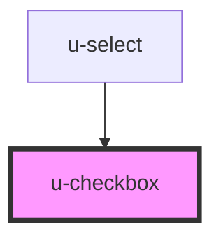

# w-checkbox

<!-- Auto Generated Below -->

## Properties

| Property   | Attribute  | Description | Type                             | Default    |
| ---------- | ---------- | ----------- | -------------------------------- | ---------- |
| `checked`  | `checked`  |             | `boolean`                        | `false`    |
| `disabled` | `disabled` |             | `boolean`                        | `false`    |
| `label`    | `label`    |             | `string`                         | `''`       |
| `size`     | `size`     |             | `"large" \| "medium" \| "small"` | `'medium'` |

## Events

| Event     | Description | Type               |
| --------- | ----------- | ------------------ |
| `wChange` |             | `CustomEvent<any>` |

## Methods

### `set(checked: boolean) => Promise<void>`

#### Returns

Type: `Promise<void>`

## Dependencies

### Used by

 - [u-select](../u-select)

### Graph

----------------------------------------------

*Built with [StencilJS](https://stenciljs.com/)*
