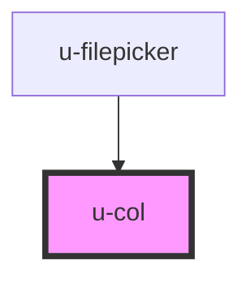

# w-col

<!-- Auto Generated Below -->

## Properties

| Property  | Attribute | Description                                                                               | Type                                                                                  | Default     |
| --------- | --------- | ----------------------------------------------------------------------------------------- | ------------------------------------------------------------------------------------- | ----------- |
| `align`   | `align`   | flex align-items: start \| center \| end \| space-between \| space-around \| space-evenly | `"center" \| "end" \| "space-around" \| "space-between" \| "space-evenly" \| "start"` | `undefined` |
| `area`    | `area`    | use with w-grid to set area                                                               | `string`                                                                              | `''`        |
| `end`     | `end`     | grid column end                                                                           | `number`                                                                              | `undefined` |
| `gap`     | `gap`     | flex gap: string, e.g. '1rem', '1px'                                                      | `string`                                                                              | `undefined` |
| `justify` | `justify` | flex justify-content: flex-start \| flex-end \| center \| baseline \| stretch             | `"center" \| "end" \| "start" \| "stretch"`                                           | `undefined` |
| `lg`      | `lg`      | size in large (≥1200px)                                                                   | `number`                                                                              | `undefined` |
| `md`      | `md`      | size in medium (≥992px)                                                                   | `number`                                                                              | `undefined` |
| `padding` | `padding` | padding bottom and top: string, e.g. '1rem', '1px'                                        | `string`                                                                              | `undefined` |
| `size`    | `size`    | used with w-grid, set size based on number of columns on w-grid (default is 12)           | `number`                                                                              | `12`        |
| `sm`      | `sm`      | size in small (≥768px)                                                                    | `number`                                                                              | `undefined` |
| `start`   | `start`   | grid column start                                                                         | `number`                                                                              | `undefined` |
| `wrap`    | `wrap`    | flex wrap: nowrap \| wrap \| wrap-reverse                                                 | `"nowrap" \| "wrap" \| "wrap-reverse"`                                                | `undefined` |
| `xl`      | `xl`      | size in extra large (≥1200px)                                                             | `number`                                                                              | `undefined` |

## Dependencies

### Used by

- [u-filepicker](../u-filepicker)

### Graph

---

_Built with [StencilJS](https://stenciljs.com/) by Hoer_
