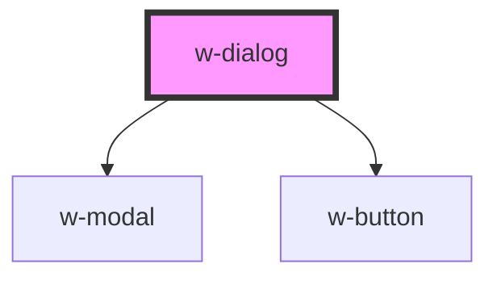

# w-dialog

<!-- Auto Generated Below -->

## Properties

| Property | Attribute | Description | Type     | Default              |
| -------- | --------- | ----------- | -------- | -------------------- |
| `name`   | `name`    |             | `string` | `'w-dialog-default'` |

## Dependencies

### Depends on

- [w-modal](../w-modal)
- [w-button](../w-button)

### Graph

----------------------------------------------

*Built with [StencilJS](https://stenciljs.com/)*
