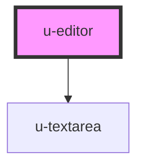

# u-editor

<!-- Auto Generated Below -->

## Properties

| Property | Attribute | Description | Type          | Default     |
| -------- | --------- | ----------- | ------------- | ----------- |
| `tools`  | --        |             | `EditorTools` | `undefined` |

## Dependencies

### Depends on

- [u-textarea](../u-textarea)

### Graph

---

_Built with [StencilJS](https://stenciljs.com/) by Hoer_
