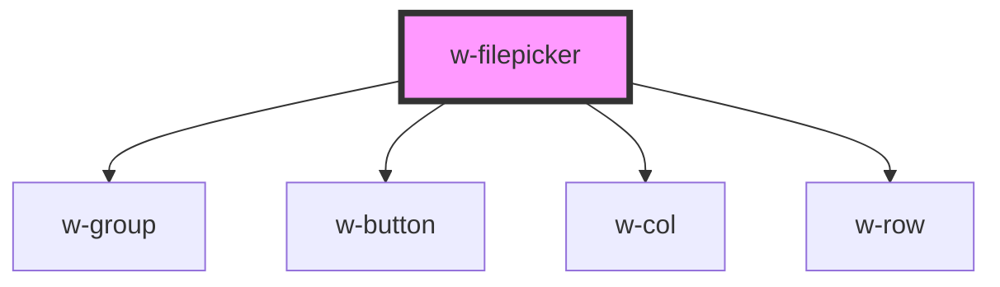

# w-filepicker

<!-- Auto Generated Below -->

## Properties

| Property     | Attribute     | Description | Type                 | Default              |
| ------------ | ------------- | ----------- | -------------------- | -------------------- |
| `fileEnding` | `file-ending` |             | `string`             | `'*'`                |
| `filePlural` | `file-plural` |             | `string`             | `'files'`            |
| `label`      | `label`       |             | `string`             | `'Choose file'`      |
| `multiple`   | `multiple`    |             | `boolean`            | `false`              |
| `noFile`     | `no-file`     |             | `string`             | `'No file selected'` |
| `size`       | `size`        |             | `"large" \| "small"` | `'small'`            |

## Events

| Event     | Description | Type                    |
| --------- | ----------- | ----------------------- |
| `wSelect` |             | `CustomEvent<FileList>` |

## Dependencies

### Depends on

- [w-group](../w-group)
- [w-button](../w-button)
- [w-col](../w-col)
- [w-row](../w-row)

### Graph

----------------------------------------------

*Built with [StencilJS](https://stenciljs.com/)*
