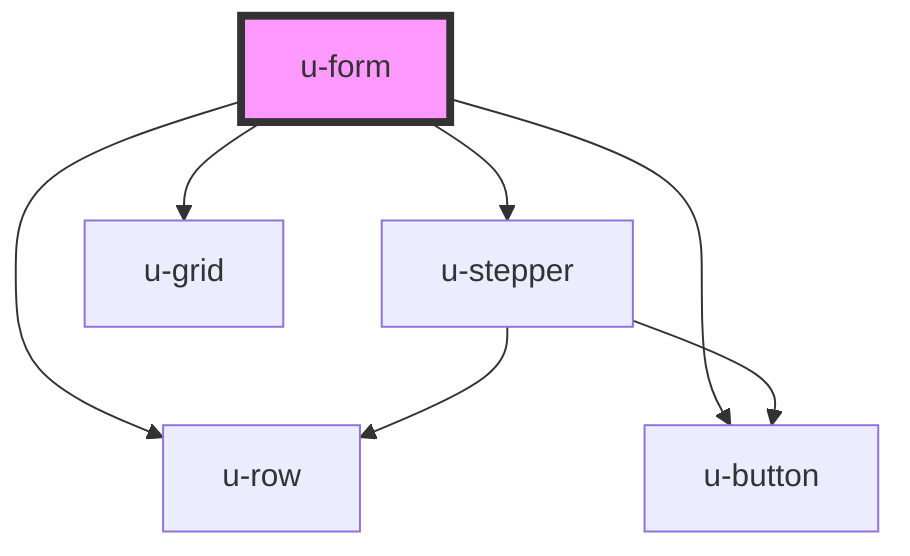

# w-form

<!-- Auto Generated Below -->

## Properties

| Property  | Attribute | Description | Type           | Default |
| --------- | --------- | ----------- | -------------- | ------- |
| `buttons` | --        |             | `FormButton[]` | `[]`    |
| `fields`  | --        |             | `FormField[]`  | `[]`    |
| `layout`  | `layout`  |             | `string`       | `''`    |

## Events

| Event       | Description | Type               |
| ----------- | ----------- | ------------------ |
| `uNextStep` |             | `CustomEvent<any>` |
| `uSubmit`   |             | `CustomEvent<any>` |

## Dependencies

### Depends on

- [u-stepper](../u-stepper)
- [u-grid](../u-grid)
- [u-row](../u-row)
- [u-button](../u-button)

### Graph

----------------------------------------------

*Built with [StencilJS](https://stenciljs.com/)*
