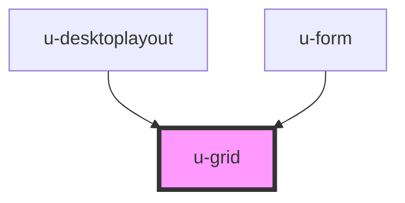

# w-grid

<!-- Auto Generated Below -->

## Properties

| Property  | Attribute | Description                                 | Type                 | Default         |
| --------- | --------- | ------------------------------------------- | -------------------- | --------------- |
| `area`    | --        | optional naming of grid areas               | `string[][]`         | `[]`            |
| `columns` | `columns` | number of columns or array of column widths | `number \| string[]` | `undefined`     |
| `gap`     | `gap`     | gap size                                    | `string`             | `'0'`           |
| `height`  | `height`  | height of grid                              | `string`             | `'max-content'` |
| `rows`    | `rows`    | number of rows or array of row heights      | `number \| string[]` | `undefined`     |
| `width`   | `width`   | width of grid                               | `string`             | `'max-content'` |

## Dependencies

### Used by

 - [u-desktoplayout](../u-desktoplayout)
 - [u-form](../u-form)

### Graph

----------------------------------------------

*Built with [StencilJS](https://stenciljs.com/)*
