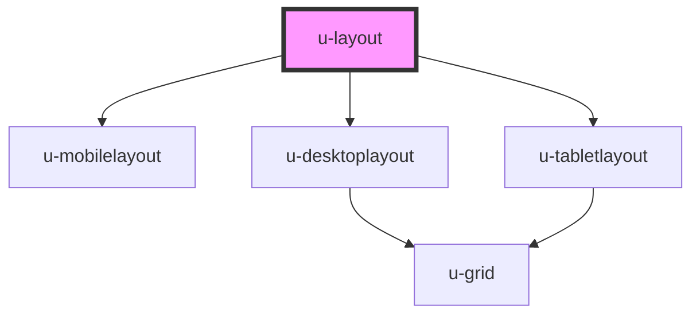

# u-layout

<!-- Auto Generated Below -->

## Usage

### Nuxt

```vue
<template>
  <u-layout>
    <u-menu slot="menu" />
    <nuxt slot="main" />
  </u-layout>
</template>
```

## Methods

### `closeOption() => Promise<void>`

#### Returns

Type: `Promise<void>`

### `showOption() => Promise<void>`

#### Returns

Type: `Promise<void>`

## Slots

| Slot              | Description            |
| ----------------- | ---------------------- |
| `"main"`          | main view              |
| `"menu"`          | menu view              |
| `"option"`        | mobile option view     |
| `"option-body"`   | desktop option content |
| `"option-header"` | desktop option title   |

## Dependencies

### Depends on

- [u-mobilelayout](../u-mobilelayout)
- [u-desktoplayout](../u-desktoplayout)
- [u-tabletlayout](../u-tabletlayout)

### Graph



---

_Built with [StencilJS](https://stenciljs.com/) by Hoer_
