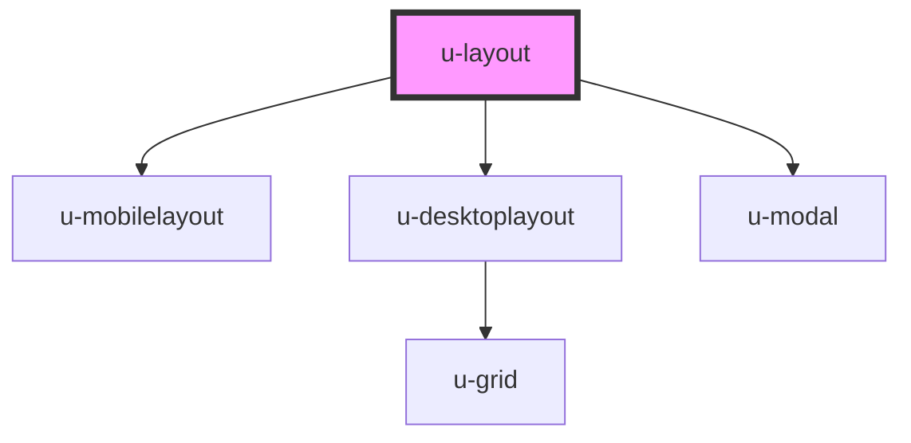

# u-layout


<!-- Auto Generated Below -->


## Usage

### Nuxt

```vue
<template>
  <u-layout>
    <u-menu slot="menu" />
    <nuxt slot="main" />
  </u-layout>
</template>
```


## Methods

### `closeOption() => Promise<void>`


#### Returns

Type: `Promise<void>`


### `showOption() => Promise<void>`


#### Returns

Type: `Promise<void>`


## Slots

| Slot       | Description |
| ---------- | ----------- |
| `"main"`   | main view   |
| `"menu"`   | menu view   |
| `"option"` | option view |


## Dependencies

### Depends on

- [u-mobilelayout](../u-mobilelayout)
- [u-desktoplayout](../u-desktoplayout)
- [u-modal](../u-modal)

### Graph


----------------------------------------------

*Built with [StencilJS](https://stenciljs.com/)*
