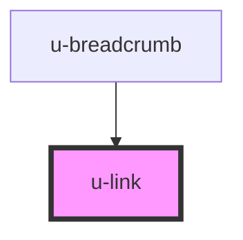

# u-link

<!-- Auto Generated Below -->

## Properties

| Property    | Attribute   | Description | Type      | Default     |
| ----------- | ----------- | ----------- | --------- | ----------- |
| `link`      | `link`      |             | `string`  | `undefined` |
| `secondary` | `secondary` |             | `boolean` | `false`     |
| `target`    | `target`    |             | `string`  | `'self'`    |

## Dependencies

### Used by

 - [u-breadcrumb](../u-breadcrumb)

### Graph

----------------------------------------------

*Built with [StencilJS](https://stenciljs.com/)*
