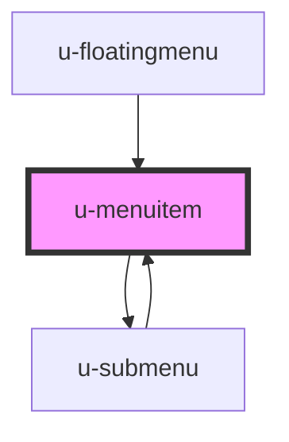

# u-menuitem

<!-- Auto Generated Below -->

## Properties

| Property     | Attribute     | Description | Type       | Default     |
| ------------ | ------------- | ----------- | ---------- | ----------- |
| `active`     | `active`      |             | `boolean`  | `false`     |
| `depthLevel` | `depth-level` |             | `number`   | `0`         |
| `item`       | --            |             | `MenuItem` | `undefined` |

## Events

| Event         | Description | Type                    |
| ------------- | ----------- | ----------------------- |
| `uItemSelect` |             | `CustomEvent<MenuItem>` |

## Dependencies

### Used by

 - [u-floatingmenu](../u-floatingmenu)
 - [u-submenu](../u-submenu)

### Depends on

- [u-submenu](../u-submenu)

### Graph

----------------------------------------------

*Built with [StencilJS](https://stenciljs.com/)*
