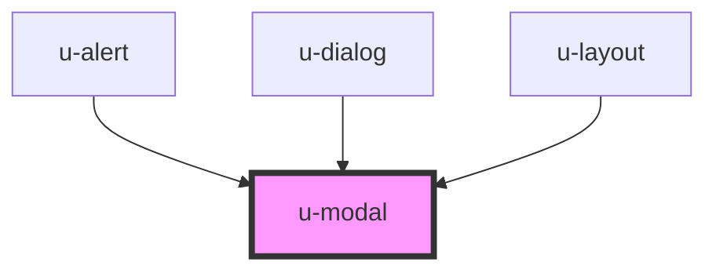

# w-modal

<!-- Auto Generated Below -->

## Properties

| Property        | Attribute         | Description | Type                    | Default     |
| --------------- | ----------------- | ----------- | ----------------------- | ----------- |
| `closeOnClick`  | `close-on-click`  |             | `boolean`               | `true`      |
| `maxHeight`     | `max-height`      |             | `string`                | `'auto'`    |
| `maxWidth`      | `max-width`       |             | `string`                | `'auto'`    |
| `minHeight`     | `min-height`      |             | `string`                | `'auto'`    |
| `minWidth`      | `min-width`       |             | `string`                | `'auto'`    |
| `mode`          | `mode`            |             | `"desktop" \| "mobile"` | `'desktop'` |
| `moveable`      | `moveable`        |             | `boolean`               | `true`      |
| `name`          | `name`            |             | `string`                | `undefined` |
| `resetPosition` | `reset-position`  |             | `boolean`               | `true`      |
| `resizeable`    | `resizeable`      |             | `boolean`               | `true`      |
| `topRightClose` | `top-right-close` |             | `boolean`               | `false`     |

## Events

| Event        | Description | Type               |
| ------------ | ----------- | ------------------ |
| `beforeOpen` |             | `CustomEvent<any>` |

## Methods

### `closeModal(name: string) => Promise<void>`

#### Returns

Type: `Promise<void>`

### `showModal(name: string) => Promise<void>`

#### Returns

Type: `Promise<void>`

## Dependencies

### Used by

 - [u-alert](../u-alert)
 - [u-dialog](../u-dialog)
 - [u-layout](../u-layout)

### Graph

----------------------------------------------

*Built with [StencilJS](https://stenciljs.com/)*
