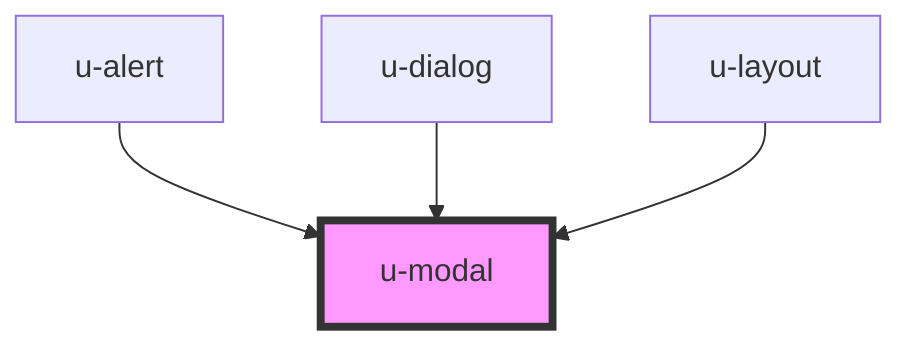

# w-modal


<!-- Auto Generated Below -->


## Usage

### Events

- open modal

```js
const body = document.querySelector('body');
body.dispatchEvent(new CustomEvent('show-modal', {
    detail: { name: 'MODAL_NAME', params: { customParam: '42' } }
    })
);
```

- close modal

```js
const body = document.querySelector('body');
body.dispatchEvent(new CustomEvent('close-modal', {
    detail: { name: 'MODAL_NAME' }
    })
);
```


## Properties

| Property        | Attribute         | Description                                                         | Type                    | Default     |
| --------------- | ----------------- | ------------------------------------------------------------------- | ----------------------- | ----------- |
| `closeOnClick`  | `close-on-click`  | should the modal be closed on backdrop click                        | `boolean`               | `true`      |
| `maxHeight`     | `max-height`      | (DESKTOP only) resizable max width                                  | `string`                | `'auto'`    |
| `maxWidth`      | `max-width`       | (DESKTOP only) resizable max height                                 | `string`                | `'auto'`    |
| `minHeight`     | `min-height`      | (DESKTOP only) resizable min height                                 | `string`                | `'auto'`    |
| `minWidth`      | `min-width`       | (DESKTOP only) resizable min width                                  | `string`                | `'auto'`    |
| `mode`          | `mode`            | autoset mode for mobile or desktop                                  | `"desktop" \| "mobile"` | `'desktop'` |
| `moveable`      | `moveable`        | (DESKTOP only) should the modal be moveable by dragging the header  | `boolean`               | `true`      |
| `name`          | `name`            | name of the modal - needed to call methods                          | `string`                | `undefined` |
| `resetPosition` | `reset-position`  | (DESKTOP only) reset the modal position to the center of the screen | `boolean`               | `true`      |
| `resizeable`    | `resizeable`      | (DESKTOP only) should the modal be resizable                        | `boolean`               | `true`      |
| `topRightClose` | `top-right-close` | display a close button in the top right corner                      | `boolean`               | `false`     |


## Events

| Event        | Description             | Type               |
| ------------ | ----------------------- | ------------------ |
| `beforeOpen` | event with given params | `CustomEvent<any>` |


## Methods

### `closeModal(name: string) => Promise<void>`

method to close the modal

#### Returns

Type: `Promise<void>`


### `showModal(name: string) => Promise<void>`

method to open the modal

#### Returns

Type: `Promise<void>`


## Slots

| Slot       | Description             |
| ---------- | ----------------------- |
| `"body"`   | The body of the modal   |
| `"header"` | The header of the modal |


## Dependencies

### Used by

 - [u-alert](../u-alert)
 - [u-dialog](../u-dialog)
 - [u-layout](../u-layout)

### Graph


----------------------------------------------

*Built with [StencilJS](https://stenciljs.com/)*
