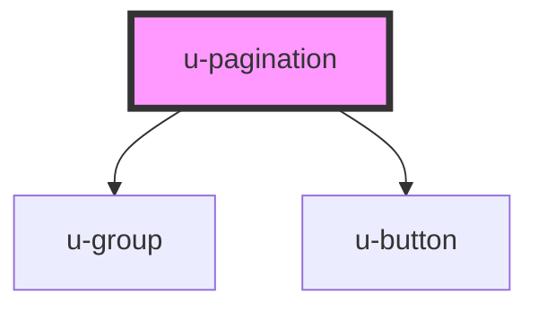

# u-pagination

<!-- Auto Generated Below -->

## Properties

| Property               | Attribute                  | Description | Type      | Default     |
| ---------------------- | -------------------------- | ----------- | --------- | ----------- |
| `pages`                | `pages`                    |             | `number`  | `undefined` |
| `showButtons`          | `show-buttons`             |             | `boolean` | `false`     |
| `showLastAndFirstPage` | `show-last-and-first-page` |             | `boolean` | `false`     |
| `showPages`            | `show-pages`               |             | `number`  | `2`         |

## Events

| Event        | Description | Type                  |
| ------------ | ----------- | --------------------- |
| `pageChange` |             | `CustomEvent<number>` |

## Methods

### `goToPage(page: number) => Promise<void>`

#### Returns

Type: `Promise<void>`

## Dependencies

### Depends on

- [u-group](../u-group)
- [u-button](../u-button)

### Graph

----------------------------------------------

*Built with [StencilJS](https://stenciljs.com/)*
