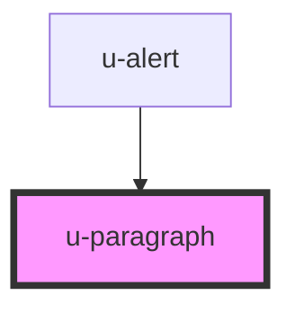

# u-paragraph

<!-- Auto Generated Below -->

## Properties

| Property          | Attribute          | Description | Type                                                   | Default     |
| ----------------- | ------------------ | ----------- | ------------------------------------------------------ | ----------- |
| `backgroundColor` | `background-color` |             | `string`                                               | `undefined` |
| `color`           | `color`            |             | `string`                                               | `undefined` |
| `hyphens`         | `hyphens`          |             | `string`                                               | `undefined` |
| `textAlign`       | `text-align`       |             | `"center" \| "jusitfy" \| "left" \| "right"`           | `undefined` |
| `textAlignLast`   | `text-align-last`  |             | `"center" \| "jusitfy" \| "left" \| "none" \| "right"` | `'none'`    |

## Dependencies

### Used by

 - [u-alert](../u-alert)

### Graph

----------------------------------------------

*Built with [StencilJS](https://stenciljs.com/)*
