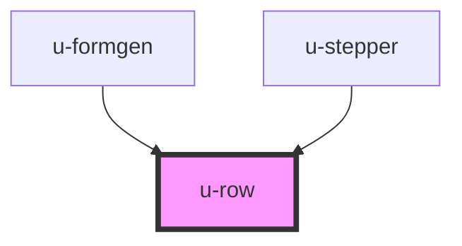

# w-row

<!-- Auto Generated Below -->

## Properties

| Property    | Attribute   | Description                                        | Type                                                                                  | Default     |
| ----------- | ----------- | -------------------------------------------------- | ------------------------------------------------------------------------------------- | ----------- |
| `align`     | `align`     | flex align-items                                   | `"center" \| "end" \| "start" \| "stretch"`                                           | `undefined` |
| `container` | `container` | should row be responsive?                          | `boolean`                                                                             | `undefined` |
| `gap`       | `gap`       | flex gap: string, e.g. '1rem', '1px'               | `string`                                                                              | `undefined` |
| `gutter`    | `gutter`    | how many columns are in the row?                   | `number`                                                                              | `undefined` |
| `justify`   | `justify`   | flex justify-content                               | `"center" \| "end" \| "space-around" \| "space-between" \| "space-evenly" \| "start"` | `'start'`   |
| `padding`   | `padding`   | padding left and right: string, e.g. '1rem', '1px' | `string`                                                                              | `undefined` |
| `width`     | `width`     | flex width behaviour                               | `"auto" \| "content" \| "full"`                                                       | `undefined` |
| `wrap`      | `wrap`      | flex wrap                                          | `"nowrap" \| "wrap" \| "wrap-reverse"`                                                | `undefined` |

## Dependencies

### Used by

- [u-formgen](../u-formgen)
- [u-stepper](../u-stepper)

### Graph

---

_Built with [StencilJS](https://stenciljs.com/) by Hoer_
