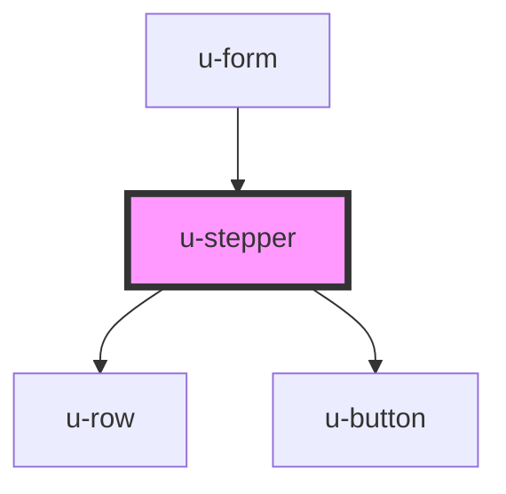

# w-stepper

<!-- Auto Generated Below -->

## Properties

| Property            | Attribute             | Description                                                                                                                     | Type                             | Default                       |
| ------------------- | --------------------- | ------------------------------------------------------------------------------------------------------------------------------- | -------------------------------- | ----------------------------- |
| `allData`           | `all-data`            | disabled state of the submit button                                                                                             | `boolean`                        | `true`                        |
| `nextLabel`         | `next-label`          | label of the next step button                                                                                                   | `string`                         | `'next'`                      |
| `nextStepAvailable` | `next-step-available` | disabled state of the next step button                                                                                          | `boolean`                        | `true`                        |
| `prevLabel`         | `prev-label`          | label of the previous step button                                                                                               | `string`                         | `'previous'`                  |
| `steps`             | `steps`               | define steps without label -> steps: 3 with label -> steps: [1,'2',3] both do the same, but with array you can define the label | `(string \| number)[] \| number` | `['Step1', 'Step2', 'Step3']` |
| `submitLabel`       | `submit-label`        | label of the next step button                                                                                                   | `string`                         | `'submit'`                    |

## Events

| Event     | Description                                        | Type                  |
| --------- | -------------------------------------------------- | --------------------- |
| `uStep`   | emit wNextStep event on next/previous button click | `CustomEvent<number>` |
| `uSubmit` | emit wSubmit event on submit button click          | `CustomEvent<void>`   |

## Dependencies

### Used by

- [u-form](../u-form)

### Depends on

- [u-row](../u-row)
- [u-button](../u-button)

### Graph

---

_Built with [StencilJS](https://stenciljs.com/)_
