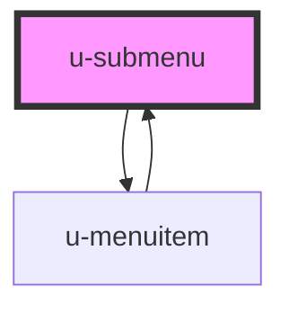

# u-submenu

<!-- Auto Generated Below -->

## Properties

| Property     | Attribute     | Description | Type         | Default     |
| ------------ | ------------- | ----------- | ------------ | ----------- |
| `active`     | `active`      |             | `boolean`    | `false`     |
| `depthLevel` | `depth-level` |             | `number`     | `0`         |
| `subMenu`    | --            |             | `MenuItem[]` | `undefined` |

## Events

| Event          | Description | Type                                                |
| -------------- | ----------- | --------------------------------------------------- |
| `uOpenSubMenu` |             | `CustomEvent<{ menu: MenuItem[]; open: boolean; }>` |

## Dependencies

### Used by

 - [u-menuitem](../u-menuitem)

### Depends on

- [u-menuitem](../u-menuitem)

### Graph

----------------------------------------------

*Built with [StencilJS](https://stenciljs.com/)*
