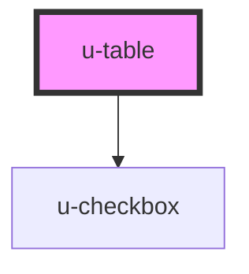

# u-table

<!-- Auto Generated Below -->

## Properties

| Property      | Attribute      | Description | Type            | Default                                                                                                                                                                                                                                                                                                                                                                                                                                                                                                                                                                                                                                                              |
| ------------- | -------------- | ----------- | --------------- | -------------------------------------------------------------------------------------------------------------------------------------------------------------------------------------------------------------------------------------------------------------------------------------------------------------------------------------------------------------------------------------------------------------------------------------------------------------------------------------------------------------------------------------------------------------------------------------------------------------------------------------------------------------------- |
| `data`        | --             |             | `any[]`         | `[     { id: 1, name: 'test', age: '20' },     { id: 2, age: 20, name: '*test2*\n_test_\n*xd*' },     { id: 3, name: 'test3', age: '40' },     { id: 4, name: 'test4', age: '50' },     { id: 5, name: 'test5', age: '-60' },     { id: 6, name: 'test6', age: '70' },     { id: 7, name: 'test2', age: '30' },     { id: 8, name: '.test3.', age: '40' },     { id: 9, name: 'test4', age: '50' },     { id: 10, name: 'test5', age: '60' },     { id: 11, name: 'test6', age: '70' },     { id: 12, name: 'test2', age: '30' },     { id: 6, name: 'test6', age: '70' },     { id: 7, name: 'test2', age: '-30' },     { id: 8, name: '.test3.', age: '40' },   ]` |
| `fixedHeader` | `fixed-header` |             | `boolean`       | `true`                                                                                                                                                                                                                                                                                                                                                                                                                                                                                                                                                                                                                                                               |
| `heading`     | --             |             | `HeadOptions[]` | `[     { field: 'id', label: 'ID', align: 'center', sortable: true, width: '10%' },     {       field: 'name',       label: 'Name',       width: '80%',       bgcolor: row => {         return row.name.includes('2') ? '#e7c2ff' : '';       },     },     {       field: 'age',       label: 'Age',       align: 'right',       sortable: true,       width: '10%',       // bgcolor: row => {       //   return row.age >= 0 ? '#afe6a8' : '#ffc382';       // },       // fontcolor: () => {       //   return 'black';       // },     },   ]`                                                                                                                  |
| `observe`     | `observe`      |             | `boolean`       | `false`                                                                                                                                                                                                                                                                                                                                                                                                                                                                                                                                                                                                                                                              |
| `resizeable`  | `resizeable`   |             | `boolean`       | `false`                                                                                                                                                                                                                                                                                                                                                                                                                                                                                                                                                                                                                                                              |
| `selectable`  | `selectable`   |             | `boolean`       | `false`                                                                                                                                                                                                                                                                                                                                                                                                                                                                                                                                                                                                                                                              |

## Events

| Event          | Description | Type                           |
| -------------- | ----------- | ------------------------------ |
| `uLastElement` |             | `CustomEvent<void>`            |
| `uSelect`      |             | `CustomEvent<any[] \| object>` |
| `uStartHover`  |             | `CustomEvent<any>`             |
| `uStopHover`   |             | `CustomEvent<any>`             |
| `uUnselect`    |             | `CustomEvent<void>`            |

## Methods

### `select(index: number) => Promise<void>`

#### Returns

Type: `Promise<void>`

### `unselect(index: number) => Promise<void>`

#### Returns

Type: `Promise<void>`

## Dependencies

### Depends on

- [u-checkbox](../u-checkbox)

### Graph

----------------------------------------------

*Built with [StencilJS](https://stenciljs.com/)*
