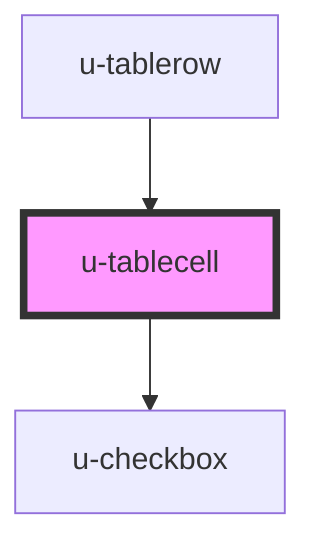

# u-tablecell

<!-- Auto Generated Below -->

## Properties

| Property   | Attribute  | Description                 | Type      | Default     |
| ---------- | ---------- | --------------------------- | --------- | ----------- |
| `checkbox` | `checkbox` | should checkbox be rendered | `boolean` | `false`     |
| `data`     | `data`     |                             | `string`  | `undefined` |

## Dependencies

### Used by

- [u-tablerow](../u-tablerow)

### Depends on

- [u-checkbox](../u-checkbox)

### Graph

---

_Built with [StencilJS](https://stenciljs.com/)_
