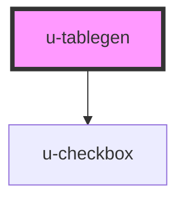

# u-tablegen

<!-- Auto Generated Below -->

## Usage

### General

Column definition

```ts
interface HeadOptions {
  field: string;
  label: string;
  width?: string;
  align?: 'left' | 'center' | 'right' | string;
  sortable?: boolean;
  bgcolor?(row: any): string;
  fontcolor?(row: any): string;
}
```

the `data` Property must use the same schema like the HeadOption.
eg is `field: 'id'`, the data must have objects with `id` keys.

### Vue

tested with Vue 2.6

```html
<template>
  <u-tablegen :data.prop="data" :heading.prop="heading">
    <h1 slot="header">Example Table</h1>
  </u-tablegen>
</template>

<script>
  export default {
      data: () {
          return {
            data: [
              { id: 1, text: 'Id no 1' },
              { id: 2, text: 'Id no 2' },
              { id: 3, text: 'Id no 3' },
              { id: 4, text: 'Id no 4' },
              { id: 5, text: 'Id no 5' },
            ]
            heading: [{
              field: 'id',
              label: 'ID',
              align: 'center'
              }, {
              field: 'text',
              label: 'Description',
              sortable: true,
              bgcolor: (row) => row.id > 3 ? 'green' : 'blue',
            }]
         },
      }
  }
</script>
```

## Properties

| Property      | Attribute      | Description                                         | Type            | Default                                                                                                                                                                                  |
| ------------- | -------------- | --------------------------------------------------- | --------------- | ---------------------------------------------------------------------------------------------------------------------------------------------------------------------------------------- |
| `data`        | --             | the data to be rendered as rows                     | `any[]`         | `[ { id: 1, text: 'test', date: '2019-01-01' }, { id: 2, text: 'test', date: '2019-01-01' }, { id: 3, text: 'test', date: '2019-01-01' }, { id: 4, text: 'test', date: '2019-01-01' } ]` |
| `fixedHeader` | `fixed-header` | the header will be sticked to the top of the table  | `boolean`       | `true`                                                                                                                                                                                   |
| `heading`     | --             | the column definition and setting                   | `HeadOptions[]` | `[ { field: 'id', label: 'ID', width: '33%' }, { field: 'text', label: 'Name', width: '33%' }, { field: 'date', label: 'Value', width: '33%' } ]`                                        |
| `observe`     | `observe`      | emits uLastElement when the last row is visible     | `boolean`       | `false`                                                                                                                                                                                  |
| `resizeable`  | `resizeable`   | should the rows be resizeable (not implemented yet) | `boolean`       | `false`                                                                                                                                                                                  |
| `selectable`  | `selectable`   | renders a checkbox in front of each row             | `boolean`       | `true`                                                                                                                                                                                   |

## Events

| Event          | Description                                                                                      | Type                           |
| -------------- | ------------------------------------------------------------------------------------------------ | ------------------------------ |
| `uLastElement` | emits uLastElement when the last element is reached and observe is true.                         | `CustomEvent<void>`            |
| `uSelect`      | emits uSelect when a row is selected. Returns an array of selected rows when selectable is true. | `CustomEvent<any[] \| object>` |
| `uStartHover`  | emits uStartHover when a row is hovered.                                                         | `CustomEvent<any>`             |
| `uStopHover`   | emits uStoptHover on mouse leave.                                                                | `CustomEvent<any>`             |
| `uUnselect`    | emits uUnselect when a row is unselected and selectable is false.                                | `CustomEvent<void>`            |

## Methods

### `select(index: number) => Promise<void>`

programmatically select a row

#### Returns

Type: `Promise<void>`

### `unselect(index: number) => Promise<void>`

programmatically unselect a row

#### Returns

Type: `Promise<void>`

## Slots

| Slot       | Description |
| ---------- | ----------- |
| `"footer"` | table foot  |
| `"header"` | table head  |

## Dependencies

### Depends on

- [u-checkbox](../u-checkbox)

### Graph



---

_Built with [StencilJS](https://stenciljs.com/) by Hoer_
