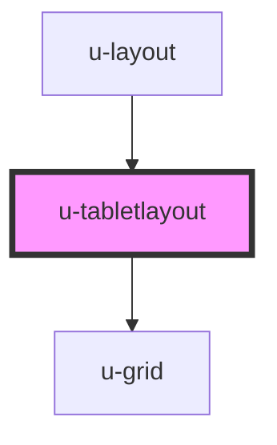

# u-tabletlayout

<!-- Auto Generated Below -->

## Properties

| Property      | Attribute      | Description | Type      | Default |
| ------------- | -------------- | ----------- | --------- | ------- |
| `showOptions` | `show-options` |             | `boolean` | `false` |
| `sideWidth`   | `side-width`   |             | `string`  | `'90%'` |

## Methods

### `hideOption() => Promise<void>`

#### Returns

Type: `Promise<void>`

### `showOption() => Promise<void>`

#### Returns

Type: `Promise<void>`

## Slots

| Slot       | Description |
| ---------- | ----------- |
| `"main"`   | main view   |
| `"menu"`   | menu view   |
| `"option"` | option view |

## Dependencies

### Used by

- [u-layout](../u-layout)

### Depends on

- [u-grid](../u-grid)

### Graph

---

_Built with [StencilJS](https://stenciljs.com/) by Hoer_
