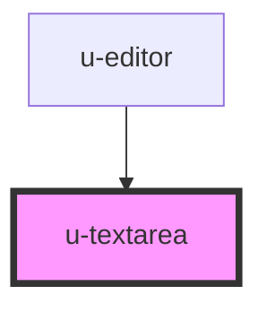

# w-textarea

<!-- Auto Generated Below -->

## Properties

| Property   | Attribute  | Description | Type                                                                         | Default       |
| ---------- | ---------- | ----------- | ---------------------------------------------------------------------------- | ------------- |
| `cols`     | `cols`     |             | `number`                                                                     | `50`          |
| `design`   | `design`   |             | `"error" \| "outline" \| "primary" \| "secondary" \| "success" \| "warning"` | `'secondary'` |
| `disabled` | `disabled` |             | `boolean`                                                                    | `false`       |
| `label`    | `label`    |             | `string`                                                                     | `undefined`   |
| `readonly` | `readonly` |             | `boolean`                                                                    | `false`       |
| `required` | `required` |             | `boolean`                                                                    | `false`       |
| `resize`   | `resize`   |             | `"both" \| "horizontal" \| "none" \| "vertical"`                             | `'vertical'`  |
| `rows`     | `rows`     |             | `number`                                                                     | `6`           |
| `size`     | `size`     |             | `"large" \| "medium" \| "small"`                                             | `'medium'`    |
| `value`    | `value`    |             | `string`                                                                     | `''`          |

## Events

| Event    | Description | Type               |
| -------- | ----------- | ------------------ |
| `wInput` |             | `CustomEvent<any>` |

## Dependencies

### Used by

 - [u-editor](../u-editor)

### Graph

----------------------------------------------

*Built with [StencilJS](https://stenciljs.com/)*
