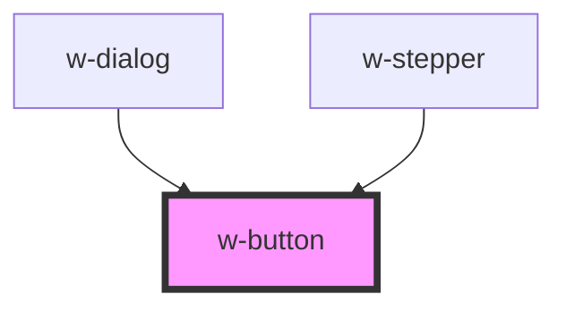

# w-button

<!-- Auto Generated Below -->

## Properties

| Property   | Attribute  | Description | Type                                                            | Default     |
| ---------- | ---------- | ----------- | --------------------------------------------------------------- | ----------- |
| `design`   | `design`   |             | `"error" \| "primary" \| "secondary" \| "success" \| "warning"` | `'primary'` |
| `disabled` | `disabled` |             | `boolean`                                                       | `false`     |
| `flat`     | `flat`     |             | `boolean`                                                       | `false`     |
| `outline`  | `outline`  |             | `boolean`                                                       | `false`     |
| `size`     | `size`     |             | `"large" \| "medium" \| "small"`                                | `'medium'`  |
| `type`     | `type`     |             | `"button" \| "reset" \| "submit"`                               | `'button'`  |

## Events

| Event    | Description | Type               |
| -------- | ----------- | ------------------ |
| `wClick` |             | `CustomEvent<any>` |

## Dependencies

### Used by

 - [w-dialog](../w-dialog)
 - [w-stepper](../w-stepper)

### Graph

----------------------------------------------

*Built with [StencilJS](https://stenciljs.com/)*
