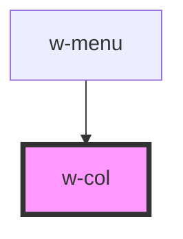

# w-col

<!-- Auto Generated Below -->

## Properties

| Property  | Attribute | Description                                                                               | Type                                                                                  | Default    |
| --------- | --------- | ----------------------------------------------------------------------------------------- | ------------------------------------------------------------------------------------- | ---------- |
| `align`   | `align`   | flex align-items: start \| center \| end \| space-between \| space-around \| space-evenly | `"center" \| "end" \| "space-around" \| "space-between" \| "space-evenly" \| "start"` | `'start'`  |
| `gap`     | `gap`     | flex gap: string, e.g. '1rem', '1px'                                                      | `string`                                                                              | `'1em'`    |
| `justify` | `justify` | flex justify-content: flex-start \| flex-end \| center \| baseline \| stretch             | `"center" \| "end" \| "start" \| "stretch"`                                           | `'center'` |
| `padding` | `padding` | padding bottom and top: string, e.g. '1rem', '1px'                                        | `string`                                                                              | `'1em'`    |
| `size`    | `size`    | used with w-grid, set size based on number of columns on w-grid (default is 12)           | `number`                                                                              | `12`       |
| `wrap`    | `wrap`    | flex wrap: nowrap \| wrap \| wrap-reverse                                                 | `"nowrap" \| "wrap" \| "wrap-reverse"`                                                | `'wrap'`   |

## Dependencies

### Used by

 - [w-menu](../w-menu)

### Graph

----------------------------------------------

*Built with [StencilJS](https://stenciljs.com/)*
