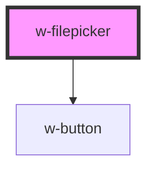

# w-filepicker

<!-- Auto Generated Below -->

## Properties

| Property     | Attribute     | Description | Type                 | Default         |
| ------------ | ------------- | ----------- | -------------------- | --------------- |
| `dropable`   | `dropable`    |             | `boolean`            | `false`         |
| `fileEnding` | `file-ending` |             | `string`             | `'*'`           |
| `label`      | `label`       |             | `string`             | `'Choose file'` |
| `multiple`   | `multiple`    |             | `boolean`            | `false`         |
| `size`       | `size`        |             | `"large" \| "small"` | `'small'`       |

## Events

| Event     | Description | Type                          |
| --------- | ----------- | ----------------------------- |
| `wSelect` |             | `CustomEvent<File \| File[]>` |

## Dependencies

### Depends on

- [w-button](../w-button)

### Graph

----------------------------------------------

*Built with [StencilJS](https://stenciljs.com/)*
