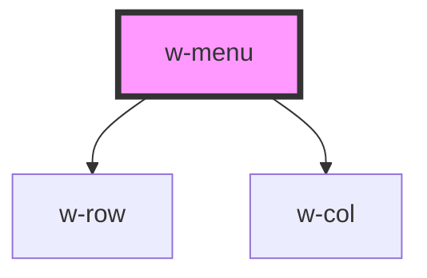

# w-menu

<!-- Auto Generated Below -->

## Properties

| Property       | Attribute      | Description | Type                                     | Default  |
| -------------- | -------------- | ----------- | ---------------------------------------- | -------- |
| `minimizeable` | `minimizeable` |             | `boolean`                                | `false`  |
| `position`     | `position`     |             | `"bottom" \| "left" \| "right" \| "top"` | `'left'` |

## Dependencies

### Depends on

- [w-row](../w-row)
- [w-col](../w-col)

### Graph

----------------------------------------------

*Built with [StencilJS](https://stenciljs.com/)*
