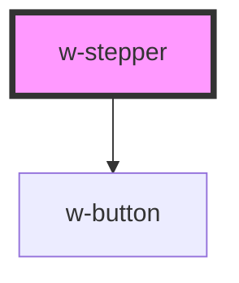

# w-stepper

<!-- Auto Generated Below -->

## Properties

| Property            | Attribute             | Description                                                                                         | Type              | Default                           |
| ------------------- | --------------------- | --------------------------------------------------------------------------------------------------- | ----------------- | --------------------------------- |
| `allData`           | `all-data`            |                                                                                                     | `boolean`         | `false`                           |
| `nextStepAvailable` | `next-step-available` |                                                                                                     | `boolean`         | `false`                           |
| `steps`             | `steps`               | define steps without label -> input number of steps with label -> input label of each step as array | `any[] \| number` | `['Name', 'Daten', 'Bestätigen']` |

## Events

| Event     | Description | Type               |
| --------- | ----------- | ------------------ |
| `wStep`   |             | `CustomEvent<any>` |
| `wSubmit` |             | `CustomEvent<any>` |

## Dependencies

### Depends on

- [w-button](../w-button)

### Graph

----------------------------------------------

*Built with [StencilJS](https://stenciljs.com/)*
